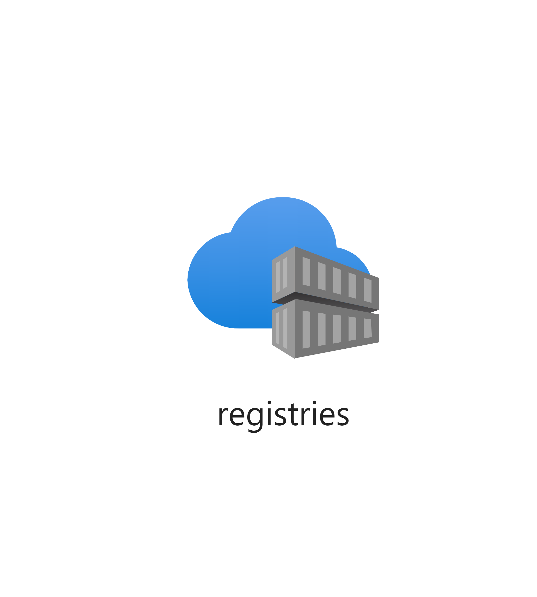

# Container Registry

Typically, an app will be deployed as a container, thus the solution will come with
its own container registry.
Creates an Azure Container Registry (ACR).

Resources: BICEP, ARM (deprecated)

Parameters:

| Parameter             | Type   | Required | Description                                                    |
|-----------------------|--------|----------|----------------------------------------------------------------|
| registryName          | String | Yes      | The name of the registry                                       |
| location              | String | No       | The resource location                                          |
| tags                  | Object | Yes      | The list of tags for the application                           |
| sku                   | String | No       | The cost-tier of the registry, default is 'Basic'              |
| adminUserEnabled      | Bool   | No       | A setting to decide if admin user is enabled or not            |

