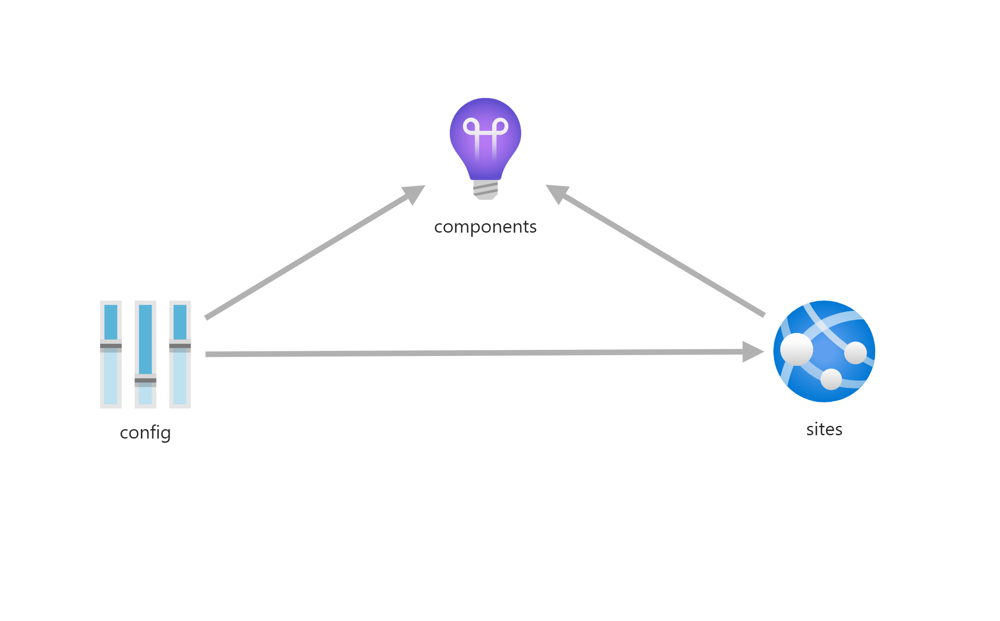

# App

Creates a web application. Parameters:

| Parameter             | Type   | Required | Description                                                    |
|-----------------------|--------|----------|----------------------------------------------------------------|
| webAppName            | String | Yes      | The name of the web application                                |
| location              | String | No       | The resource location                                          |
| tags                  | Object | Yes      | The list of tags for the application                           |
| appserviceResourceId  | String | Yes      | The ID of the app service plan the app runs on                 |
| containerRegistryName | String | Yes      | The name of the container registry that holds the docker image |
| containerImageName    | String | No       | The docker image name to run (default application name)        |
| containerImageTag     | String | Yes      | The docker image tag                                           |
| appGatewayIp          | String | Yes      | Ip address the security restriction is valid for               |
| appCommandLine        | String | No       | Command to run on container startup (entry_point.sh)           |
| allowedCorsOrigins    | Array  | No       | List of allowed sites for cross origin requests                |
| acrResourceGroup      | String | No       | Specify if container registry is in another resource group     |

## Creating a web app with application insights
To create an application connected to an application insights instance, refer to this example for passing the
application insights key to the app.

```json
{
    "type": "Microsoft.Resources/deployments",
    "apiVersion": "2019-10-01",
    "name": "[variables('appInsightsDeploymentName')]",
    "properties": {
        "mode": "Incremental",
        "templateLink": {
            "uri": "https://raw.githubusercontent.com/equinor/ioc-shared-infrastructure/master/resources/resourceAppInsights/azuredeploy.jsonc",
            "contentVersion": "1.0.0.0"
        },
        "parameters": {
            "appInsightsName": {
                "value": "[variables('appInsightsName')]"
            },
            "workspaceResourceId": {
                "value": "[variables('workspaceResourceId')]"
            },
            "ingestionMode": {
                "value": "[variables('ingestionMode')]"
            },
            "tags": {
                "value": {
                    "Environment": "[parameters('environment')]"
                }
            }
        }
    }
},
{
    "type": "Microsoft.Resources/deployments",
    "apiVersion": "2019-10-01",
    "name": "[variables('webappBeDeploymentName')]",
    "dependsOn": [
        "[concat('almond_plan_', parameters('environment'))]", // App service plan
        "[variables('appInsightsDeploymentName')]"
    ],
    "properties": {
        "mode": "Incremental",
        "templateLink": {
            "uri": "https://raw.githubusercontent.com/equinor/ioc-shared-infrastructure/master/resources/resourceApp/azuredeploy.jsonc",
            "contentVersion": "1.0.0.0"
        },
        "parameters": {
            "webAppName": {
                "value": "[variables('webappBeName')]"
            },
            "tags": {
                "value": {
                    "Environment": "[parameters('environment')]"
                }
            },
            "appserviceResourceId": {
                "value": "[resourceId('Microsoft.Web/serverfarms',concat('s039-ioc-almond-plan-',parameters('environment')))]"
            },
            "containerRegistryName": {
                "value": "[variables('registryName')]"
            },
            "containerImageName": {
                "value": "almondbe"
            },
            "containerImageTag": {
                "value": "[parameters('containerImageTag')]"
            },
            "acrResourceGroup": {
                "value": "S039-ioc-almond-rg-dev"
            },
            "appCommandLine": {
                "value": "./entry_point.sh"
            },
            "allowedCorsOrigins": {
                "value": [
                    "http://localhost:5001",
                    "[variables('portalUrl')",
                    "[concat('https://s039-ioc-almondfe-app-', parameters('environment'), '.azurewebsites.net')]"
                ]
            },
            "environmentVariables": {
                "value": [
                    {
                        "name": "INSIGHT_INSTRUMENTATION_KEY",
                        "value": "[reference(variables('appInsightsDeploymentName')).outputs.instrumentationKey.value]",
                        "slotSetting": false
                    },
                ]
            },
            "appGatewayIp": {
                "value": "Any"
            }
        }
    }
},
```



